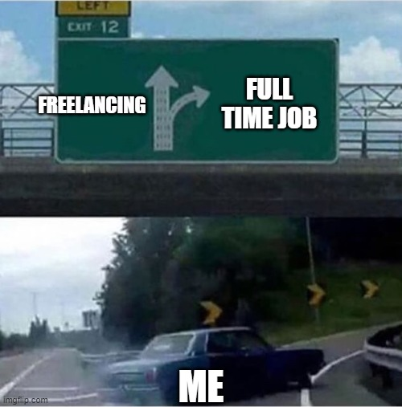

After a couple of years of freelancing, the idea of working for a company started tickling me. I decided to start looking for a job in the tech industry. Not that I wasn't into it already, but as a freelancer you feel you see the industry goes by you, even if you keep yourself up to date with the latest tools and tendencies.

I won't lie nor hide the fact that as a freelancer in Argentina you barely touch the surface money-wise. Clients pay late, but the job needs to get done by yesterday. Through the years I managed to get a bit better at this by asking for half the pay up front and the rest when the job's finished. But the job never really finishes and if it does, beginning from that day onwards you'll have to wait for your pay... * *sigh* *

What I found really satisfying, though, was that as a freelo you're in full control of the solution you're providing, in fact, you may sell/convince your client that what's best for her/him coincides with what's easier for you. And that's usually the case. Therefore designing solutions, thinking what tech stack is needed and then learn and implement the *thing* is a process in which you really grow as a professional.

After a few rounds of interviews with different companies from my country and abroad, I was offered a couple of positions. Both as a frontend engineer. The first one was at [Stämm Biotech](http://www.stamm.bio/), a friend referred me but I declined (even though I like what it's going on there) and went with [Raven](https://www.raven.com/) which offered me better salary and working remote-first. Of course I also like the product here and the fact that I work with ppl from all around the world! (not really, +-4hs CST timezone).

It's been great so far and I actually enjoy the routine that I'm obliged to follow. As a freelancer my circadian clock was my manager, now I try to keep working hours during the day `¯\_(ツ)_/¯`

Also, it might be worth mentioning that I learned a whole new level of workflow and techs. We use CircleCI for our pipeline, Angular for the frontend, TypeScript and JavaScript which I knew already, and now I know how *not to break* my source control (git) as I need to collaborate more than I needed before, so that skill definitely leveled up.

### Current endeavours

Here at Raven I work in [Raven Desktop](https://www.raven.com/pages/desktop) which is the desktop app to use with Raven Scanners. After a bunch of bugfixes I managed to implement a few features already. The first one was a new destination for the scanning results, your documents are sent to any destination you choose such as cloud services (Raven Cloud, Google Drive, One Drive, etc.) and also local such as a folder, or a local application you have installed. I added the latest, it's called [Devonthink](https://www.devontechnologies.com/apps/devonthink) and helps you manage documents. Another (and more important) feature is that I implemented functionality with a new scanner model which hasn't come out yet by the time of this writing! I had to work with **C++ bindings** which was really challenging even though I had some C++ (openFrameworks) background. Another challenge was to follow up with driver developers from the other side of the world to sync up about low level bit alignment issues we were having with our `struct`s. **Fun stuff. Hard stuff. Rewarding stuff :D**

I like how working in a small company gives you a sense of impact in your actions. Discussions are always open and suggestions are listened. Teams are small and we iterate fast. You can see your work get into production and then hear feedback from customers. It's a quite satisfying cycle.

Some freelo work still comes to me but I tend to say **no**. I usually end up quite tired as I need to get productive hours counted in on a software we use for remote employees, so I have to say my days are a bit longer now. *That's not cool*. Anyways, I still enjoy this path as I feel it's very rewarding.