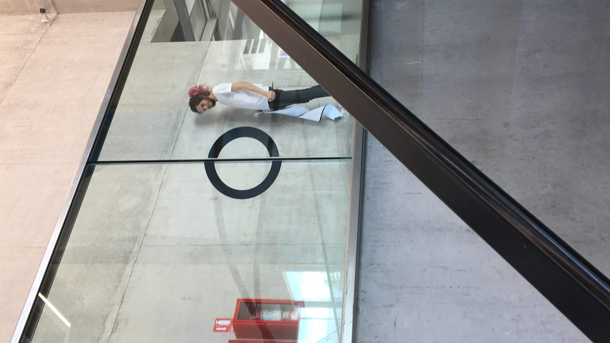

```
2018
Vinilo negro matte autoadhesivo
Museo Mar
Mar del Plata, Buenos Aires, Argentina
```

<br />
<div style="padding:56.25% 0 0 0;position:relative;"><iframe src="https://player.vimeo.com/video/625016744?h=02877561b9&amp;badge=0&amp;autopause=0&amp;player_id=0&amp;app_id=58479" frameborder="0" allow="autoplay; fullscreen; picture-in-picture" allowfullscreen style="position:absolute;top:0;left:0;width:100%;height:100%;" title="No son seniales"></iframe></div><script src="https://player.vimeo.com/api/player.js"></script>
<br />

¿Cómo observamos nuestro entorno? ¿Cómo ubicamos nuestros cuerpos frente a los mensajes que constantemente recibimos? ¿Hay una sola manera de verlos, son únicos? ¿Cómo nos posicionamos ante los diferentes estímulos?

_Mirada sin recetas – Mirada reseteada._

Desnaturalizar la mirada es un trabajo complejo. Tenemos un conjunto de valores preestablecidos en los que confiamos _ciegamente_, y así percibimos la realidad.

Conocemos el mundo en dos dimensiones; pantallas, cuadros, ventanas hacia otros universos: ¿qué sucede si quitamos la profundidad de lo que vemos en lo tridimensional, si todo se encuentra en el mismo plano?




------------------

Hay tantas interpretaciones como personas, esta obra es una síntesis de esta experiencia, lo formal es anecdótico, es un juego que llama a la atención.

La contemplación requiere también un movimiento, involucrarse con lo que la obra propone, tal vez desde la sorpresa, o la búsqueda activa.

Desnaturalizar la mirada aprendida, *resetear la mirada*, quebrar los esquemas preestablecidos, dialogar con la institución a través de un site specific, volver a jugar con esa mirada de forma primitiva, *mirada sin recetas*.

La propuesta de un punto de vista único es una mención a lo que hace la institución del arte o el museo, donde la obra es contemplada y dirigida de una forma específica, en cambio esa misma forma puede tener otros matices o deformidades igual de válidas.

------------------

Ver: [@patentepatente](https://www.instagram.com/patentepatente/)

> Instagram de patentes coleccionadas. Mensajes que vi en la calle. _O me llegaron. Como la patente._

------------------

La obra consiste en tres intervenciones en el espacio del Museo Mar, se trata de anamorfismos, imágenes que adquieren coherencia al encontrar el punto de vista indicado. Dos piezas son formas de círculos y la tercera es el título mismo de la obra: **NO SON SEÑALES**.

Busqué desnaturalizar la mirada de lxs espectadorxs, provocar un juego de miradas para encontrar el mensaje deseado, o no.

