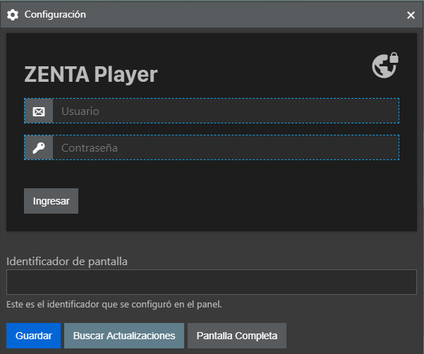

import Img from 'gatsby-image'
import { FaHeart, FaClock } from "react-icons/fa"
import { GoRepoForked } from "react-icons/go"

  
  

I was asked to integrate new features to an existing _pair_ of applications. These are two companion apps, one is the admin panel on which the user is able to upload media files, then generate playlists of the content and finally assign these playlists to your available devices. These devices then run the _other_ app, which is just a Player for this content. In both of them you are asked to log in so that all your content and settings are saved.

## Uses

This system is intended to be used to manage your screens remotely. Say you own a big ad billboard near the highway which has an enormous LED display. You could just hook a **Rasberry Pi** (with some mobile internet maybe) and control what to show according to your client's schedule for ad time. Set up once and you're done. The player will automatically download the media files and play them according to the selected playlist.

## The Project

I was asked to examine "some programs" to see if I could modify them and extend their functionality. As I checked the files I found JS code and soon realised it was an [Electron](https://www.electronjs.org/) app. I just knew Electron _existed_ but didn't understand its structure whatsoever. I _wetransfered_ everything to my email. After playing for a while **I started hacking**, with Electron and AWS docs by my side. **Always**.

I was asked to finish it (had a few bugs) and add some features:
- Add a login so that it could be offered as a service for many clients.
- Migrate AWS account (previous dev's account was hardcoded).
- Fix player bugs.
- Build for Windows and Linux (RPi).

These few items triggered some new ones in my head:
- Add the concept of **playlists** which would allow clients to use the same configured list to many devices without having to repeat the process of adding the files to each device.
- Start using a modern JS library to connect to AWS instead of bare HTTP calls.
- Implement Login screen also in Player app (before, the client would only add an id in a text-box to link to the files).

## Tech

Both apps were started in Electron as my _client's first client_ wanted a desktop application. I could have disagreed.
- The admin panel could be a webapp.
- Playing videos within Electron in a Raspberry Pi 3 is **not** the best idea.

I was intrigued by Electron and felt this was the opportunity to get in touch with this technology. It is quite appealing the fact that with some JS library anyone can create a multiplatform desktop application. So I just went with the flow...

Since it _kind_ of worked before, I thought... maybe it's not that bad. Well, the player in a Raspberry Pi had to run in 720p for the framerate to be acceptable. This is because it is not using my beloved <FaHeart /> [OMX Player](https://www.raspberrypi.org/documentation/raspbian/applications/omxplayer.md), which uses hardware acceleration to play stuff, therefore optimising RPi's resources. Instead, it just embeds a `<video>` tag rendered in the under-the-hood-Chromium of Electron apps.

I knew the idea behind AWS but had never used it until then. I quickly grasped the concepts behind Cognito and S3, the only services I needed for the task.

Users are created in Cognito User Pool and when logged in for the first time the software creates the folder structure in an S3 bucket destined to the application. Then the user would upload media files which end up in their S3 folder. Information about playlists, files and devices are stored in a `.json` file within the user's directory. This data is then used by the player to be able to fetch the playlists and the files.

## Wrapping up

I worked on this almost one year and a half ago from this time of writing, so I'm sorry if it seems vague in its details, but it's just the fact that I lost the pieces of paper in which I logged my work... <small>another reason to keep this blog going</small>. 

It took me a while. I learned AWS, its services, the privileges, authentication, Electron, a lot of different ways to code stuff, it was fun and interesting, quite complete training with an objective ahead. 

I believe this could be enhanced in **a lot** of ways... but <FaClock />. The repo is private and _I think_ I shouldn't share builds in public, maybe if some radical changes were planned, a fork <GoRepoForked /> could be born... So feel free to contact me for whatever reason, doubt, feeling you get!