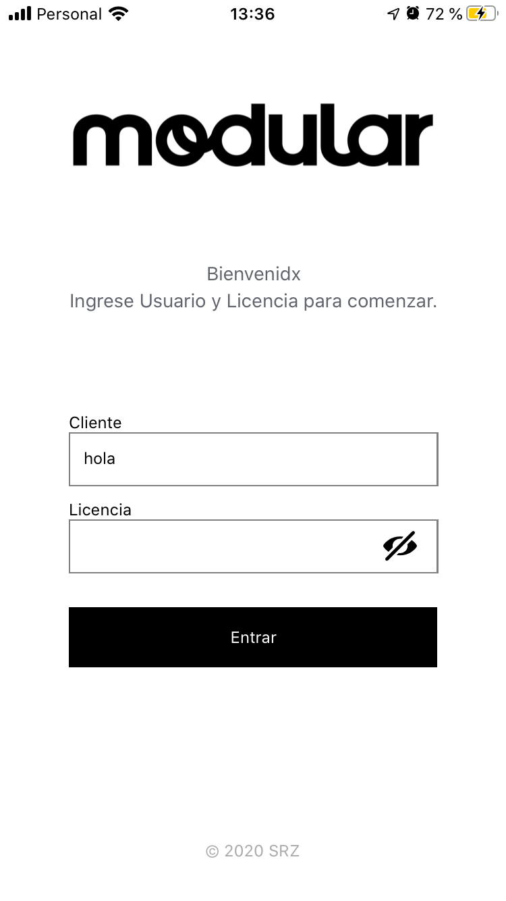

[Modular música](http://modularmusica.com/) es una aplicación mobile para el proyecto de musicalización de [Soledad Rodriguez Zubieta](https://www.instagram.com/_srz).

La desarrollamos junto con [Claus Hesse](https://github.com/claushesse) y [Tomás Ciccola](https://gitlab.com/tomasciccola). Consiste en un player que sincroniza playlists que prepara SRZ para cada cliente, por ejemplo un negocio de ropa, bar, etc.

El flow es que uno se loggea con credenciales que provee SRZ y automáticamente se sincronizan en el dispositivo un listado de tracks que son reproducidos según la hora del día, también cuenta con una playlist alternativa. Estos tracks se reproducen continuamente hasta repetirse si se acaban, con _crossfade_ entre ellos (no es un dato menor!). La musicalizadora sube las pistas a un servidor que cuenta con una API creada por [Leandro Garber](https://gitlab.com/macramole) de donde levantamos toda la data (datos de cliente, su licencia y los tracks).

Estamos en proceso burocrático de subir al AppStore y Google Play, pero la app ya cuenta con una versión estable funcionando. Pronto link!
<!-- 
Aquí unas capturas:

    
    

 -->
